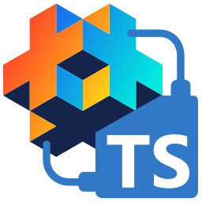

<!-- Generated from packages/docs/guide/README.md by `bun run readme:sync`. Do not edit directly. -->

# defold-typescript

  

Build your [Defold](https://defold.com/) game in [TypeScript](https://www.typescriptlang.org/) and get VSCode's full editor experience — autocomplete, inline type errors, and safe refactors — across the whole Defold API, while still shipping the plain [Lua](https://www.lua.org/) the engine runs.

- **The full Defold API, typed** — every module and namespace is typed from the official reference, so `go`, `gui`, `vmath`, `msg`, and the rest autocomplete and type-check as you write.
- **Compiles to plain Lua** — your TypeScript runs through the battle-tested [TypeScriptToLua](https://typescripttolua.github.io/) (TSTL) compiler down to the Lua Defold already runs: no engine fork, no proprietary runtime, no lock-in.
- **Typed scripts end to end** — `self`, `on_message`, and `on_input` payloads are typed through `defineScript`, `defineGuiScript`, and `defineRenderScript`.
- **Fits new and existing projects** — scaffold from scratch, or add the TypeScript surface to a project that already has `game.project` and adopt type safety gradually, one script at a time alongside your existing Lua.
  - **Preserves your project layout** — TypeScript blends into the existing project structure without creating a wrapper folder.
- **Built for the real loop** — `watch` recompiles beside the Defold editor, live transpile diagnostics surface errors inline, and source maps let you set breakpoints in your `.ts`.

This guide shows how to scaffold a project, write TypeScript that the toolchain compiles to Lua, and look up the language-and-toolchain quirks you will hit along the way.

The sections below mirror the top navigation; each lists the pages in its left-sidebar order. The repository `README.md` is generated from this file so the GitHub landing page and docs homepage stay aligned.

## Get started

- [Getting started](https://defold-typescript.github.io/toolchain/getting-started) — install Bun, scaffold a new project with `bunx @defold-typescript/cli@latest init my-game`, write a one-screen script, and build to Lua with `bunx @defold-typescript/cli build`.
- [Existing project](https://defold-typescript.github.io/toolchain/add-typescript) — run `bunx @defold-typescript/cli@latest init .` in a folder with `game.project` to add the TypeScript surface without replacing the Defold project.
- [Editor setup](https://defold-typescript.github.io/toolchain/editor-setup) — open the project in VSCode, use the generated `tsconfig.json`, and run `bunx @defold-typescript/cli watch` beside the Defold editor.
- [Defold editor](https://defold-typescript.github.io/toolchain/defold-editor) — install Defold, open the generated project folder, attach a compiled script (`.ts.script`, `.ts.gui_script`, or `.ts.render_script`) to its game object, GUI scene, or render pipeline, and run the game (TypeScript is transpiled to Lua by the CLI, not the editor).

## Guides

### Tutorial

- [Build Tetris](https://defold-typescript.github.io/toolchain/tetris-tutorial) — build a complete Tetris game from scratch: write TypeScript, compile it to Lua, and wire the scene in the Defold editor, seeing the whole workflow end to end.

### TypeScript

- [TypeScript vs Lua](https://defold-typescript.github.io/toolchain/typescript-vs-lua) — the Lua-developer on-ramp: a cheat sheet that translates syntax, tables, modules, and the standard library from Lua to the TypeScript the toolchain expects.
- [TypeScript gotchas](https://defold-typescript.github.io/toolchain/typescript-gotchas) — the canonical catalog of TS / [TypeScriptToLua](https://typescripttolua.github.io/) (TSTL) / Defold sharp edges. Today: the unary-minus quirk that silently produces `number` from a `Vector3`. Future entries land here as the toolchain encounters them.
- [Data structures](https://defold-typescript.github.io/toolchain/data-structures) — what's built in for Defold: `Array`, tuple, `Map`, `Set`, `WeakMap`, `WeakSet`, object record, and `class`, each with its Lua lowering and `lualib` cost, plus the not-available list (regex, `BigInt`, `LinkedList`) and what to reach for instead.

### Core concepts

- [Script lifecycle](https://defold-typescript.github.io/toolchain/script-lifecycle) — type `self`, `on_message`, and `on_input` payloads with `defineScript`, `defineGuiScript`, and `defineRenderScript`.
- [Messages](https://defold-typescript.github.io/toolchain/messages) — the `BuiltinMessages` catalog, `msg.post` send-side payload narrowing, and the `isMessage` / `onMessage` receive-side helpers.
- [Where script state lives](https://defold-typescript.github.io/toolchain/script-state) — the four state tiers — per-instance `self`, a shared module local, a cross-script module singleton, and VM-global `declare global` — each grounded in the emitted Lua.
- [Vector math](https://defold-typescript.github.io/toolchain/vector-math) — the method-form arithmetic surface (`add`, `sub`, `mul`, `div`, `unm`) on `Vector3`, `Vector4`, `Quaternion`, and `Matrix4`, plus why you cannot write `v3 + v3`.

### CLI

- [init](https://defold-typescript.github.io/toolchain/init) — scaffold a new Defold project with a TypeScript surface, or add TypeScript to an existing project; the two modes, the `--template` / `--force` flags, and the starter templates.
- [watch](https://defold-typescript.github.io/toolchain/watch) — the incremental rebuild loop: recompile Lua on every save beside the Defold editor, and re-resolve the extension surface on `game.project` changes.
- [build](https://defold-typescript.github.io/toolchain/build) — one-shot transpile of every `src/` TypeScript file to Lua, plus the headless `defold` subcommand that drives `bob` to build and bundle the project.
- [wall](https://defold-typescript.github.io/toolchain/wall) — opt-in per-directory API walls that narrow a single-kind source directory to its script-kind surface, in interactive and flag forms.
- [resolve](https://defold-typescript.github.io/toolchain/resolve) — generate ambient TypeScript namespaces from your `game.project` native-extension dependencies, with pin/drift detection and a `--frozen` lockfile mode.

### Toolchain & workflow

- [Transpile diagnostics](https://defold-typescript.github.io/toolchain/transpile-diagnostics) — the scaffolded `@defold-typescript/tstl-plugin` language-service plugin that surfaces TypeScript-to-Lua transpile errors live in the editor, advisory-only and never blocking `tsc --noEmit`.
- [Debugging](https://defold-typescript.github.io/toolchain/debugging) — step through `.ts` source with breakpoints via the Local Lua Debugger and the scaffolded Bun launch path (no shell, Windows-native), resolving through the emitted `<name>.ts.script.map`.
- [Agent runbooks](https://defold-typescript.github.io/toolchain/agent-runbooks) — harness-neutral procedures for driving the CLI from an automated agent: scaffold a project, [install the agent contract](https://defold-typescript.github.io/toolchain/agent-runbooks#install-the-agent-contract), regenerate extension types, [add and attach a script](https://defold-typescript.github.io/toolchain/agent-runbooks#add-a-script) (build, wire the compiled component, verify), and fix the Lua output over the `--json` envelope, gating on `ok`.

### Project configuration

- [Pinning the Defold version](https://defold-typescript.github.io/toolchain/pinning-defold-version) — keep the default latest surface, or pin an older Defold version whose API surface is generated on the fly and materialized into a project-local `.defold-types/<version>/`.
- [Native extensions](https://defold-typescript.github.io/toolchain/extensions) — declare an extension in `game.project` `[dependencies]`, then run [`resolve`](https://defold-typescript.github.io/toolchain/resolve) to generate an ambient namespace per `.script_api` into a gitignored `.defold-types/extensions/` surface, and consume it with no import.

### Migration

- [API docs vs `ts-defold-types`](https://defold-typescript.github.io/toolchain/api-docs-vs-ts-defold) — a factual, dimension-by-dimension comparison of the JSDoc that `@defold-typescript/types` and `ts-defold-types` emit (Markdown conversion, dash params, grid-aligned multi-line docs, branded constants, the `@example` trade-off), with a picker for which surface fits your project.
- [Migrating from `ts-defold`](https://defold-typescript.github.io/toolchain/migrating-from-ts-defold) — move a project off the `@ts-defold/*` stack: the package/tooling map, the step-by-step port via `init` add-TypeScript mode and a `tsconfig.json` reconcile, and the type-surface differences you will hit.

## Reference

- [API](https://defold-typescript.github.io/toolchain/api) — the generated `@defold-typescript/types` reference: every documented Defold namespace, grouped alphabetically as cards (site-only; built from the typed surface the toolchain ships).
- [Lua standard library](https://defold-typescript.github.io/toolchain/api/base) — the pure-Lua / LuaJIT reference category (`base`, `bit`, …). Types are owned by the `lua-types` dependency the `lua-stdlib-globals` goal adopted; `@defold-typescript/types` does not re-emit them as generated namespaces.
